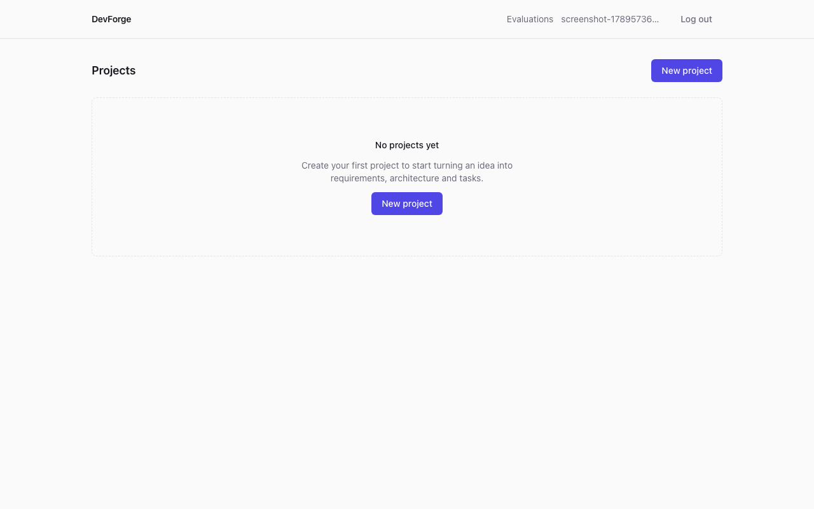
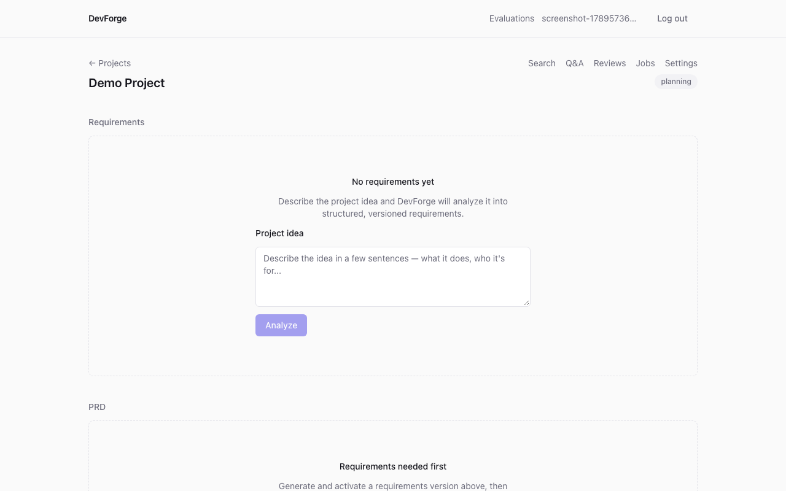
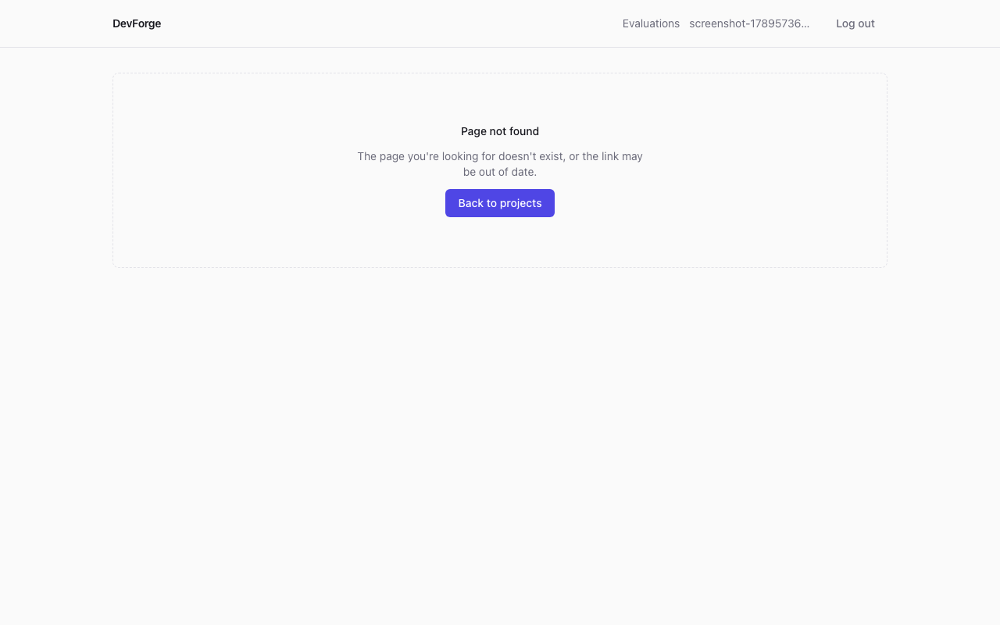
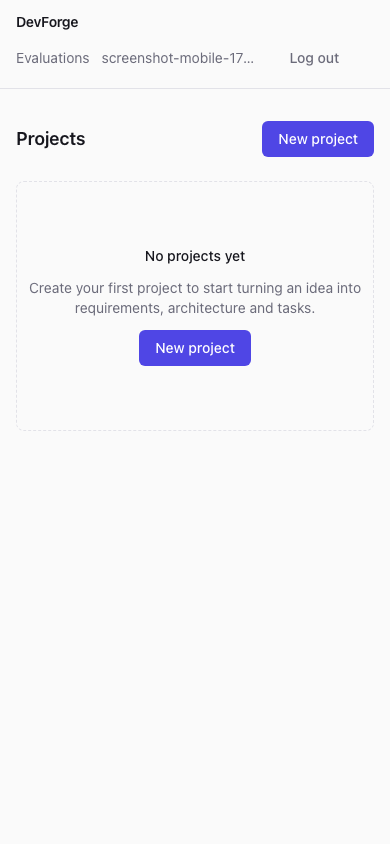

# Demo

`scripts/demo.mjs` is a deterministic, dependency-free (plain Node `fetch`, no npm packages) end-to-end demo that drives the real running DevForge stack over its real HTTP API, exactly as a real user's browser would. It requires no manual setup, no GitHub personal access token, and no Anthropic/Voyage AI key — every step that needs one of those honestly reports the real "not configured" error DevForge returns in that case, exactly matching the honesty guarantee documented throughout [README.md](../README.md#known-limitations). If real credentials *are* available, the corresponding steps use them for a fully real run instead.

## Running it

```bash
docker compose up -d
docker compose ps   # wait for all four services to report healthy
node scripts/demo.mjs
```

Optional environment variables unlock the "real" path for the steps that need them — set any subset:

```bash
GEMINI_API_KEY=... VOYAGE_API_KEY=pa-... docker compose up -d --build   # pass real keys to ai-service (GEMINI_API_KEY preferred; ANTHROPIC_API_KEY also supported)
GITHUB_TOKEN=ghp_... GITHUB_OWNER=your-username GITHUB_REPO=your-repo node scripts/demo.mjs
```

`DEMO_API_URL` overrides the API base URL (default `http://localhost:4000`) if running against a non-default port.

## What it covers

The script exercises all 12 steps of the required demonstration workflow:

1. **Confirms the stack is up** (`GET /health`, `GET /ready`).
2. **Registers a fresh demo user and starts a session** (`POST /auth/register`) — a new, timestamped email every run, so the script is safely re-runnable without manual cleanup between runs.
3. **Creates a project** (`POST /projects`).
4. **Attempts a repository connection** (`POST /projects/:id/repository/connect`) — with real `GITHUB_TOKEN`/`GITHUB_OWNER`/`GITHUB_REPO` if supplied, or demonstrates and prints the real, honest `GITHUB_INTEGRATION_NOT_CONFIGURED` response otherwise.
5. **Attempts requirements analysis** (`POST /projects/:id/requirements/analyze`) — real generation if `GEMINI_API_KEY` or `ANTHROPIC_API_KEY` is configured (Gemini preferred), otherwise the real `AI_PROVIDER_UNAVAILABLE` response.
6. **Attempts PRD generation** (`POST /projects/:id/prd/generate`) — demonstrates the dependency-chain error (`NO_ACTIVE_REQUIREMENTS`) when step 5 didn't produce an active requirements version, exactly as a real user seeing a disabled/error state would.
7. **Attempts codebase search, Q&A, and AI code review** — each demonstrates the real `NO_COMPLETED_INDEX` dependency error when no repository is indexed.
8. **Creates a background indexing job and polls it to a terminal state** (`POST`/`GET /projects/:id/jobs`) — this step works fully without any external credential: the job is really queued, really claimed by the real worker, and really reaches a clean terminal `failed` state with a real, visible error when no repository is connected — proving job creation, tracking, and failure visibility all work end to end even in a fully credential-free environment.
9. **Demonstrates failure and recovery**: retries the failed job (`POST /projects/:id/jobs/:jobId/retry`) — DevForge's real, tested recovery path (bounded by the job's own `maxRetries`), not a simulated one.
10. **Lists job history** (`GET /projects/:id/jobs`) and confirms the run is visible.

Steps 4–7 are expected to show "not configured" responses in an environment with no external credentials — **this is correct, documented behavior, not a demo failure.** The script prints ℹ️ (not ❌) for these and explains why. A genuinely broken step (one that should always work regardless of credentials — health, registration, project creation, job creation/tracking/retry) prints ❌ and exits non-zero, since those are real bugs if they ever fail.

## Screenshots

Taken live against the running local stack (`docker compose up -d`), after Phase 18's two UI fixes (see [README.md](../README.md#changelog)):

| | |
|---|---|
|  Empty project list with a clear call-to-action |  A created project's overview page |
|  The 404 page for an unmatched route (previously blank) |  Mobile header (390px) — "Log out" now stays reachable, no horizontal overflow |

## Verified

This script was run to completion multiple times against the real local `docker-compose` stack (no credentials present) during Phase 18 development — every run completed deterministically with the exact same step-by-step shape, cleaning up its own generated demo users afterward (`DELETE FROM users WHERE email LIKE 'demo-%@example.com'`). It is not a description of an intended demo — it is a real, runnable one.
