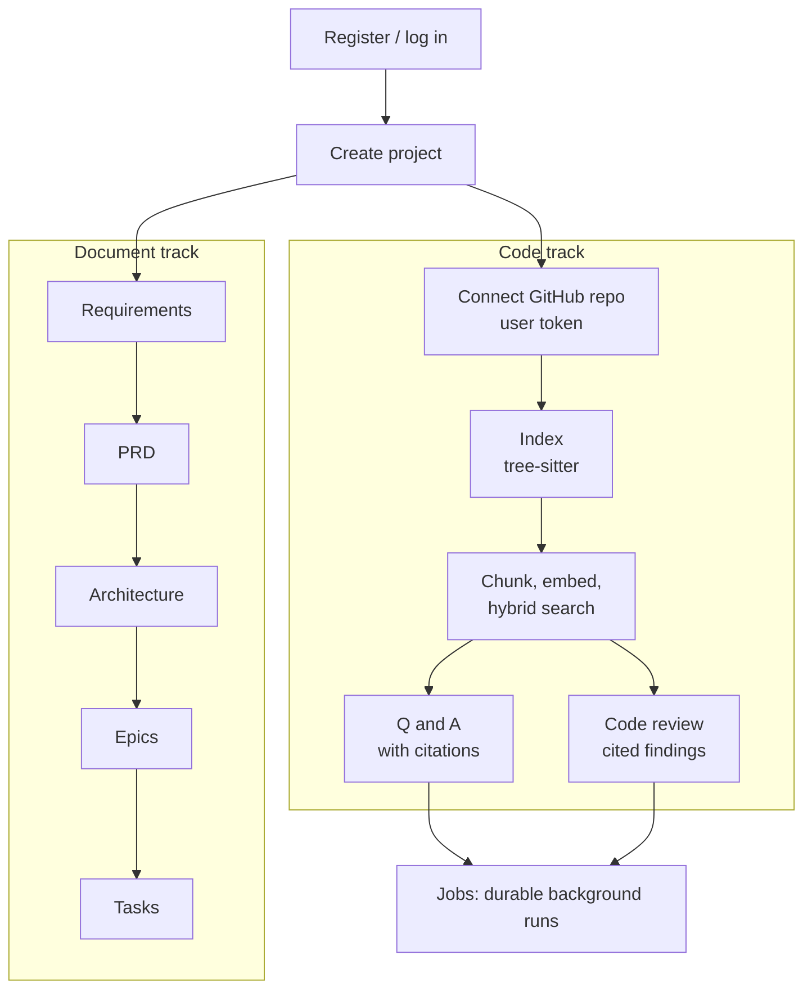
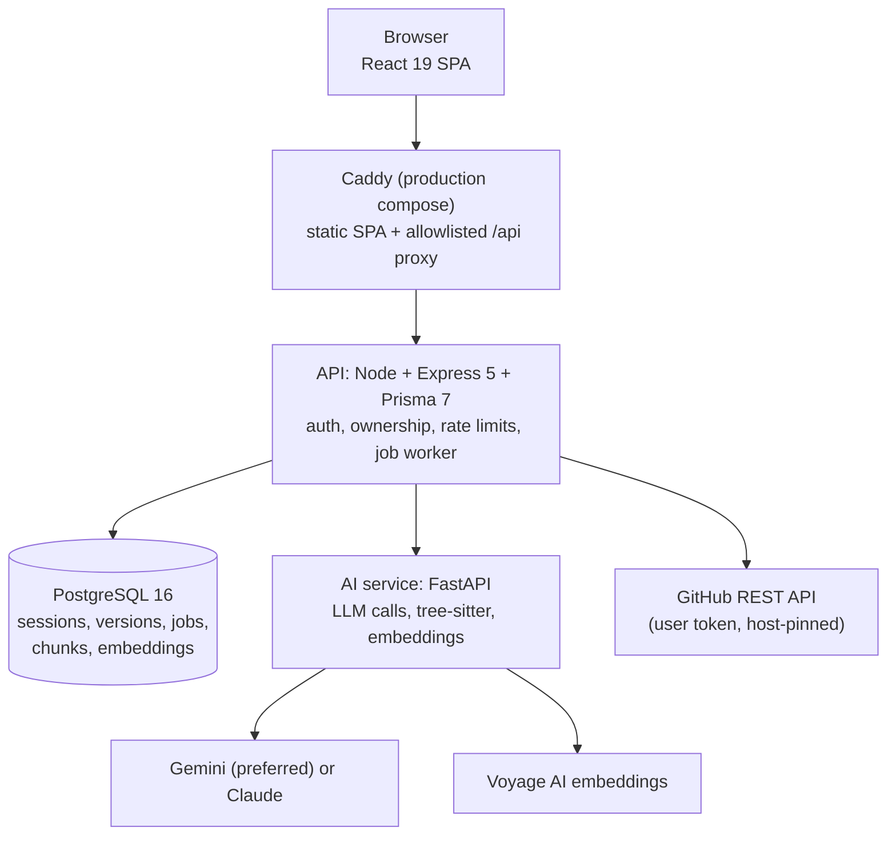

# DevForge – AI-Powered Software Engineering Workspace

*A case study of a full-stack, multi-service AI product: what it does, how it is built, how it was measured, and what it does not do.*

Facts in this document come from the repository, its phase reports, the latest evaluation report, and verification runs performed on 2026-09-20 (commit `cb6efe8` plus uncommitted deployment work). Each claim is marked as implemented, tested, live verified, or planned where the distinction matters.

---

## 1. Executive Overview

DevForge is a workspace that turns a project idea into a chain of structured, versioned engineering documents (requirements, PRD, architecture, epics, tasks) using a large language model, and lets a user connect a GitHub repository to ask grounded, cited questions about the code and to run an AI code review. It is a monorepo of a React frontend, a Node/Express API backed by PostgreSQL, and a Python FastAPI AI service, run together with Docker Compose.

The design goal was trustworthiness rather than breadth of AI features. Every AI capability fails honestly when a provider or credential is missing (a real `503`, never a fabricated result). Code answers and review findings can only cite sources that retrieval actually returned: the model selects numbered sources and the API resolves file paths and line ranges itself, so a hallucinated citation is structurally impossible. When there is no evidence, the answer is a deterministic "insufficient evidence" response without calling the model.

The system is measured by an offline evaluation harness (109 golden cases: 67 retrieval, 21 Q&A, 21 review) that gates regressions, by automated suites across the API, frontend, AI service and evaluation package, and by a 67-check smoke and exposure test run against the production-style local deployment and its temporary public tunnel. Limits are documented as prominently as capabilities: for example, evaluation results use mock model providers and a fixture dataset, and end-to-end Q&A and review on a real repository require a user-supplied GitHub token that was not available for the demo recording.

## 2. The Problem

Two recurring problems motivated the project.

**Turning an idea into engineering artifacts is slow and unstructured.** Requirements, a PRD, an architecture and a task list are usually written by hand, drift apart, and lose the reasoning that connected them. A model can draft them, but a single free-form response is hard to review, edit, compare or trace.

**Answers about code are only useful if they can be checked.** Language models describe code confidently, including code they have not seen. A tool that answers questions about a repository is only trustworthy if every claim points at real code, if the tool says so when it does not know, and if the retrieved code itself cannot instruct the model to misbehave.

DevForge addresses both with structured, versioned outputs (each stage builds on the previous *active* version) and with a citation-safe retrieval design.

## 3. Product Workflow

A project has two tracks. The **document track** (implemented, live verified) generates each stage from the currently active version of the previous one; every stage is versioned, editable, comparable and can be re-generated. The **code track** (implemented and tested) requires a connected repository: index, search, Q&A and review, each available synchronously and as a background job. An Evaluations page shows results of the offline benchmark.

## 4. System Architecture

| Component | Responsibility | Boundary |
|---|---|---|
| Frontend | UI, forms, version viewers and editors, evidence display | Talks only to the API, same-origin `/api` in production |
| Caddy | Serves the built SPA, proxies only `/api/auth`, `/api/projects`, `/api/evaluations`, `/api/health`; strips the `/api` prefix; 1 MB body limit; security headers | Only published port (loopback); runs non-root, read-only, all capabilities dropped except bind |
| API | Authentication, project ownership, business logic, retrieval ranking, citation resolution, background jobs, all database access | The only service that touches PostgreSQL and GitHub |
| AI service | Model calls with schema-validated output, tree-sitter parsing, embedding generation | Reachable only on the internal network; never talks to GitHub or the database |
| PostgreSQL | Durable state including the job queue | Internal network only |

**Why this split.** Keeping all persistence, authorization and citation resolution in the API means the model service holds no user data and cannot decide what counts as evidence. Keeping model, parsing and embedding code in Python puts it next to the libraries that provide them. The two services communicate over plain HTTP inside the compose network.

## 5. Requirements Intelligence

**Input.** A free-text project idea (up to 2,000 characters).

**Processing.** The API sends the idea to the AI service, which asks the configured model for output constrained to a Pydantic schema. The response is validated before it is returned; invalid output is an error, not a partial result.

**Structured output.** Project summary, user roles, functional and non-functional requirements (each with priority, acceptance criteria and a **stated vs inferred** tag), features, risks, constraints, assumptions and open questions.

**Versioning and persistence.** Each analysis creates a new version and makes it active; older versions are kept. Versions can be listed, viewed, edited, activated and compared (structural diff). The same pattern repeats for the next four stages, each generated from the active version of the previous one, with explicit dependency messages when the upstream stage is missing.

**Traceability.** Each generated document is tied to the version it was derived from; epics and tasks record their dependencies and, for tasks, the epic they belong to. Individual requirement fields are editable through the API; the UI edits the summary and list fields (a documented scope choice).

**Verified.** During the demo recording the full chain (requirements, PRD, architecture, epics, tasks) ran live against Gemini, with 17, 21, 25, 20 and 27 seconds per request. Earlier attempts hit a transient provider `502` and a free-tier rate limit; these surface as real errors in the UI.

## 6. Repository Understanding and Code Intelligence

1. **Connection.** The user supplies a personal access token, verified against the real GitHub API before saving. The token is encrypted at rest (AES-256-GCM) and never returned by any response; only the last four characters are shown. GitHub calls are pinned to the GitHub host.
2. **Indexing.** The selected branch is resolved to a commit and its file tree fetched. Python, TypeScript and JavaScript files are parsed with tree-sitter into symbols (classes, interfaces, type aliases, functions, methods) with correct nesting. Other files are recorded with a reason (unsupported, binary, oversized), never silently dropped. Limits: 500 files and 300 KB per file. Re-indexing the same commit reuses the completed index.
3. **Chunking.** One chunk per symbol; oversized symbols are split with overlap; symbol-less files become whole-file chunks. Secret-shaped strings (AWS keys, GitHub tokens, private-key blocks, JWTs, credentialed connection strings) are redacted before chunks are stored, embedded or sent to a prompt.
4. **Embedding and search.** Chunks are embedded with Voyage `voyage-code-3` on first search and reused for that commit. Ranking is a hybrid score (below).

Incremental indexing, a reference graph and query-intent classification exist as ranking inputs; a pure-delegate penalty demotes thin wrapper functions except for entry-point queries.

## 7. AI Architecture

**Providers.** Requirements, PRD, architecture, epics, tasks, Q&A and review all go through one shared structured-output layer. Gemini (`gemini-3.6-flash` in code) is preferred when `GEMINI_API_KEY` is set; Anthropic (`claude-opus-5`) is a supported alternative used when only `ANTHROPIC_API_KEY` is set. Embeddings use Voyage `voyage-code-3`.

**Retrieval.** Hybrid score = semantic cosine similarity (dominant) combined with lexical token overlap, symbol-identifier matching (including an exact-substring boost) and file-path matching. Results are kept only while within a documented relative margin (0.78) of the top result, so the system returns fewer, better sources instead of padding to a fixed count. Similarity is computed in Node over PostgreSQL `Float[]` columns; there is no vector database (see Future Improvements).

**Prompt and context.** At most 8 numbered source excerpts and 16,000 characters of code are sent after de-duplicating overlapping chunks. Retrieved code is framed as untrusted data: the system prompts instruct the model to ignore instruction-like text inside it and never repeat a secret. No tool use is granted to the model.

**Evidence handling and validation.** The structured output can only *select sources by number*. It never returns a path, symbol or line number; the API fills those from its own retrieval records. A review finding left with no valid citation is dropped, never stored. A confident-looking answer citing zero valid sources is replaced by the deterministic insufficient-evidence answer. Empty evidence skips the model call entirely.

**Fallbacks and reliability.** Missing credentials return an honest `503 PROVIDER_NOT_CONFIGURED`. Gemini calls have a bounded per-call timeout and a short retry for transient overload errors only; Voyage calls retry with backoff under its free-tier rate cap.

**Why.** The aim is to make the property "every citation is real" hold by construction instead of relying on prompt wording, and to make failure visible instead of producing a plausible fake.

## 8. Evaluation

Source: `evaluation/reports/latest.md`, regenerated on 2026-09-20 at commit `cb6efe8` by `pnpm eval` (mode: mock, dataset 2026.09.16-2). Numbers below supersede older intermediate figures in earlier phase reports.

| Area | Result | Status |
|---|---|---|
| Golden dataset | 106 of 109 cases matched their exact expectation (67 retrieval, 21 Q&A, 21 review); regression gates decide pass/fail | Passed, all 13 gates green |
| Retrieval quality (64 answerable + 3 unanswerable cases) | Recall@3 93.2%, Recall@5 95.8%, Precision@1 92.5%, MRR 95.3%, nDCG@5 90.3%, direct-hit 92.2%, useful-context 90.1% | Measured, mock embeddings |
| Retrieval safety | Duplicate results 0%, empty results on answerable cases 0%, false-confidence 0% | Measured |
| Q&A (21 cases) | Citation precision and recall 100%, invalid citations 0%, unsupported claims 0%, insufficient-evidence accuracy 100% | Measured with hand-authored mock answers |
| Review (21 cases) | Finding precision and recall 100%, false-positive rate 0%, citation validity 100%, empty-review correctness 100% | Measured with hand-authored mock findings |
| API tests | 483 passed | Run 2026-09-20 |
| Frontend tests | 132 passed | Run 2026-09-20 |
| AI-service tests | 154 passed (pytest) | Run 2026-09-20 |
| Evaluation-package tests | 168 passed | Run 2026-09-20 |
| Typecheck | Clean across api, frontend, tests, evaluation | Run 2026-09-20 |
| Lint | 0 errors, 2 pre-existing warnings | Run 2026-09-20 |
| Deployment smoke and exposure test | 67 of 67 checks passed against the local stack and the public tunnel | Live verified |
| Live provider check | Requirements to tasks chain generated against Gemini | Live verified |

**How to read these numbers.** The evaluation is deterministic and offline: a lexical-similarity proxy stands in for Voyage embeddings, and each case's hand-authored answer or findings stand in for the model. It therefore measures retrieval ranking, citation grounding logic and gating, not the quality of live model output. It is a fixture benchmark, not proof of correctness on arbitrary code. An optional `pnpm eval:real` mode calls the real AI service; it was not run for this study.

## 9. Security and Multi-User Isolation

**Authentication.** Opaque random session tokens in an HttpOnly cookie; only their SHA-256 hash is stored. Passwords use bcrypt (cost 12). Rate limits: 20 requests per 15 minutes on login and register, 1,000 per 15 minutes elsewhere. `helmet` headers and structured audit logging (register, login, logout, ownership denial, repository connect and disconnect) are enabled.

**Isolation.** Every project-scoped query filters by the authenticated owner through one shared ownership helper, and a second, independent middleware re-checks ownership at the route boundary. A missing project and another user's project both return `404`, never `403`, so existence is not leaked. Limitation stated in the README: isolation is enforced at the application layer, not with database row-level security.

**CSRF.** No token layer, by documented decision: fixed-origin CORS and `SameSite=Lax` cookies block cross-site state changes. It would need revisiting if the CORS posture changed.

**Problem, remediation, verification (examples found during development):**

| Problem found | Remediation | Verification |
|---|---|---|
| No rate limiting, unbounded list queries, no secret redaction of indexed repository content, `.`/`..` repository-name path confusion (Phase 16 audit) | Rate limiter, list cap on 8 queries, deterministic secret redaction at chunk-build time, stricter repo-name validation | Dedicated tests, including an end-to-end at-rest redaction test |
| Behind a reverse proxy every client shared the proxy's IP, so rate limits throttled all users as one | `TRUST_PROXY_HOPS` setting; Caddy forwards a single resolved client address | Probe confirmed per-client buckets, spoofed forwarding headers ineffective, `429` after 20 auth calls |
| Docker build context could include local `.env` files (a deployment token in a frontend `.env.local`) | `.dockerignore` hardened for all `.env*` and local tooling directories | Image layers scanned; no secret values found |
| SPA fallback answered `/api` and dotfile paths with `200` | Explicit `404` handlers in the Caddyfile | Smoke test covers traversal and encoding evasions |

## 10. Engineering Challenges

**1. Citations that cannot be hallucinated.**
*Why it mattered:* an answer with a fake file path is worse than no answer.
*Decision:* the model outputs only source numbers; the API resolves paths and lines from its own retrieval records and drops unsupported findings.
*Result:* invalid-citation and unsupported-claim rates are 0% in the evaluation, and the property is enforced by schema rather than by prompt.

**2. Retrieval quality on a small, honest benchmark.**
*Why:* an early 14-case benchmark looked perfect but proved little.
*Decision:* expand to 67/21/21 cases across three languages with graded relevance, add a benchmark audit and a hidden anti-overfitting fixture, then fix two real defects in the hybrid score (no stopword filtering, no fuzzy token matching) and re-tune the cutoff from a persisted comparison.
*Result:* the final gates hold (Recall@5 95.8%, MRR 95.3%), with the caveat that the benchmark is small and offline.

**3. Durable background jobs without a broker.**
*Why:* indexing and embedding can outlast a request.
*Decision:* an in-process worker claims jobs from PostgreSQL with `SELECT … FOR UPDATE SKIP LOCKED`, with retries, timeouts, cooperative cancellation and lease-expiry crash recovery; no Redis.
*Result:* tested job lifecycle; the known limit is that cancellation is cooperative, not preemptive.

**4. Real provider behavior differs from documentation.**
*Why:* live runs with real keys exposed a hard 3-requests-per-minute Voyage cap and transient Gemini overloads.
*Decision:* bounded retry with backoff for embeddings, a bounded per-call timeout and targeted retry for Gemini, and per-job-type timeouts (20 minutes for Q&A and review, 4 for indexing).
*Result:* fixes committed after being reproduced live; the free tiers still return real rate-limit errors, which the UI reports honestly.

**5. Honest failure over fake success.**
*Why:* demo-friendly fallbacks would hide real problems.
*Decision:* every AI path returns `503` or a real error when a credential is missing, and the frontend shows disabled controls with dependency messages instead of buttons that would fail.
*Result:* the demo recording shows genuine empty states for the parts that need a GitHub token.

**6. Deploying the whole stack for free, safely.**
*Why:* a portfolio project should be reachable without paid hosting.
*Decision:* a Caddy allowlist proxy in front of the API, loopback-only publishing, and an optional Cloudflare Quick Tunnel.
*Result:* 67 smoke checks pass locally and through the tunnel; see section 11.

## 11. Deployment Architecture

**Local development** (`docker-compose.yml`): PostgreSQL 16, API, AI service and a frontend container, with migrations applied on start.

**Production-style local deployment** (`docker/docker-compose.prod.yml`, project `devforge-prod`): four containers on a private network. PostgreSQL, the API and the AI service publish no ports. Caddy is the only entry point, bound to `127.0.0.1`, non-root with a read-only filesystem, dropped capabilities and `no-new-privileges`. Memory limits per container (Postgres 256 MB, AI service 384 MB, API 512 MB, Caddy 64 MB). Secrets are generated into a git-ignored `.env.production` by the start script; nothing secret is baked into images. The API validates its environment at startup (Zod) and, in production, rejects placeholder secrets and a test-database URL.

**Temporary public access.** A Cloudflare Quick Tunnel can point at the loopback port so the app is reachable for a demo. It is a temporary convenience, distinct from the local deployment: the URL changes on every start, offers no uptime guarantee, and is not published in this document. Scripts start and stop only the tunnel process they created.

## 12. Technical Stack

| Category | Technology | Purpose |
|---|---|---|
| Frontend | React 19, TypeScript (strict), Vite, Tailwind CSS v4, React Router v7 | SPA, routing, styling |
| API | Node.js, Express 5, Prisma 7 (pg adapter), Zod | HTTP API, ORM, validation |
| Database | PostgreSQL 16 | State, sessions, job queue, embeddings as `Float[]` |
| AI service | Python, FastAPI, Pydantic | Structured model calls, parsing, embeddings |
| Models | Gemini (`gemini-3.6-flash`), Claude (`claude-opus-5`), Voyage `voyage-code-3` | Text generation and code embeddings |
| Parsing | tree-sitter | Symbol extraction for Python, TypeScript, JavaScript |
| Security | bcrypt, AES-256-GCM, helmet, express-rate-limit | Passwords, token encryption, headers, throttling |
| Deployment | Docker Compose, Caddy, Cloudflare Quick Tunnel (temporary) | Local production-style stack, public demo access |
| Testing | Vitest, Testing Library, pytest, Playwright (demo and browser checks) | Unit, component, service and browser tests |
| Repo tooling | pnpm workspaces, ESLint, TypeScript | Monorepo, linting, typechecking |

## 13. Testing and Reliability

| Category | Count or result | Notes |
|---|---|---|
| Unit and API tests | 483 passing (API), 154 passing (AI service) | API suite includes ownership, authentication, rate-limit and secret-pattern tests |
| Frontend tests | 132 passing | One timing-sensitive Jobs test flaked once under machine load and passed in isolation and on rerun |
| Integration tests | 11 suites in `tests/` covering register/login, projects, requirements through tasks, repository, index, retrieval, Q&A and review | Not re-run for this study, so no count is cited here |
| Evaluation tests | 168 passing in the evaluation package; 109 golden cases in the benchmark | Offline, deterministic |
| Browser and live checks | Playwright-driven UI runs against the local stack and the tunnel; requirements-to-tasks chain against a live model | Live verified 2026-09-20 |
| Security tests | Cross-user access, forged cookie, logout invalidation, CORS, body-size limit, blocked internal paths, secret-leak scan of every response (part of the 67 smoke checks); ownership and secret-pattern tests in the API suite | No separate count is claimed |

## 14. Key Engineering Decisions

| Decision | Reason | Trade-off | Outcome |
|---|---|---|---|
| Model selects source numbers, API resolves citations | Make fake citations impossible | Model cannot quote lines it was not given | 0% invalid citations in evaluation |
| PostgreSQL as job queue (`SKIP LOCKED`) instead of Redis | One fewer service to run and secure | Polling, lower throughput ceiling, cooperative cancel | Durable jobs with crash recovery |
| `Float[]` embeddings and cosine in Node instead of pgvector | Simplicity at per-project scale | Linear scan will not scale to a large monorepo | Fine at current scale; upgrade path documented |
| Hybrid score with adaptive cutoff | Return fewer, better sources | Weights are hand-picked, not learned | Recall@5 95.8% on the fixture benchmark |
| Opaque database sessions instead of JWT | Simple revocation on logout | A database lookup per request | Old cookie rejected after logout (tested) |
| 404 instead of 403 for foreign resources | Do not leak existence | Slightly less informative errors | Verified in smoke test |
| Gemini preferred, Claude supported | A free tier lowers the barrier to run it | Two providers to keep compatible | Both behind one structured-output layer |
| Same-origin production proxy | Avoids cross-site cookies and CORS surface | Extra container | `SameSite=Lax` cookies work end to end |
| Offline deterministic evaluation | Runs in CI-style settings without paid keys | Does not measure live model quality | Stable regression gates |

## 15. Demo

[Watch the DevForge Demo Video](../demo-assets/recordings/DevForge_demo_draft.mp4)

The 2:50 video, recorded from the real application with fictional data, shows: registration and sign-in; creating a project; the five-stage AI document chain generated live (five real requests, each sped up 4x with the real duration labeled on screen); honest empty states for repository, indexing, Q&A and review; a real evaluation run (106 of 109 cases matched, all gates passed); the background jobs page; and a second account being unable to open the first account's project. Architecture and retrieval-pipeline slides are included. It does **not** show repository indexing, search, Q&A or review running live, because those need a GitHub token supplied by the user.

## 16. Results

| Measure | Value |
|---|---|
| Golden evaluation cases matched | 106 of 109; all 13 regression gates passed |
| Retrieval | Recall@5 95.8%, MRR 95.3%, Precision@1 92.5% |
| Invalid citations, unsupported claims, false-confidence | 0% in evaluation |
| Automated tests passing | API 483, frontend 132, AI service 154, evaluation 168 |
| Deployment smoke and exposure checks | 67 of 67, locally and through the tunnel |
| Live document chain | Requirements to tasks completed, 17 to 27 seconds per stage |
| Repository size | 287 commits over 2026-09-12 to 2026-09-17 in git history, plus uncommitted deployment and portfolio work |

## 17. What I Learned

- A guarantee enforced by a schema is worth more than one requested in a prompt. Letting the model choose numbers instead of paths removed a whole class of failure and made it measurable.
- A benchmark that scores 100% on 14 cases told me almost nothing. Growing it, auditing it and adding a hidden fixture found real ranking defects that the small set had hidden.
- Real providers behave differently from their documentation. Live runs with real keys found rate caps and overload errors that no mock would have, and each fix was small once the failure was reproduced.
- Failing honestly is a product feature. Disabled buttons with dependency messages and real `503` responses made the application easier to debug and easier to trust.
- Deployment is part of the design. Behind a proxy, the rate limiter silently treated all users as one until I set the trusted-proxy count, and only a probe with spoofed headers proved the fix.
- Writing down limitations, such as cooperative cancellation and application-level isolation, made later decisions clearer than pretending they did not exist.

## 18. Future Improvements

These are planned or suggested, not implemented (from the README's future-work section):

- A separate worker process for jobs and preemptive cancellation.
- A BM25 lexical index with reciprocal-rank fusion, learned hybrid weights, and an approximate-nearest-neighbor store such as pgvector.
- Multi-turn Q&A and iterative review context (today each request is independent).
- Caller-supplied branch or commit on Q&A and review.
- Running the evaluation in CI, and a larger benchmark backed by real embeddings and human labels.
- A CSRF token layer if the CORS or cookie posture ever changes.
- Support for languages beyond Python, TypeScript and JavaScript.

## 19. Portfolio Summary

**A. Two-sentence description.** DevForge is a full-stack AI workspace that turns a project idea into versioned requirements, PRD, architecture, epics and tasks, and answers questions about a connected GitHub repository with citations that cannot be fabricated. It runs as a Docker Compose stack of a React frontend, a Node and PostgreSQL API, and a Python AI service, and is measured by an offline evaluation harness and automated suites.

**B. One-line resume bullet.** Built DevForge, a full-stack AI engineering workspace (React, Node/Express, PostgreSQL, FastAPI) with citation-safe code Q&A and review, an offline evaluation harness, and a hardened Docker deployment.

**C. Resume bullets.**

- Designed a citation-safe retrieval pipeline (tree-sitter symbol chunking, Voyage embeddings, hybrid ranking) where the model selects numbered sources and the API resolves paths and lines, reaching 0% invalid citations and Recall@5 of 95.8% on a 109-case offline benchmark.
- Implemented multi-user isolation with opaque hashed sessions, redundant ownership checks returning 404, rate limiting and secret redaction, and verified it with 67 smoke and exposure checks against a Caddy-fronted, non-root, read-only container deployment.
- Built a PostgreSQL-backed job queue (`SKIP LOCKED`, retries, lease recovery) and a chained, versioned AI document pipeline, backed by 483 API, 132 frontend, 154 AI-service and 168 evaluation tests.

**D. Technical keywords.** Retrieval-augmented generation; structured LLM output; hybrid search; tree-sitter; PostgreSQL job queue; multi-tenant authorization; Docker Compose; evaluation harness.
